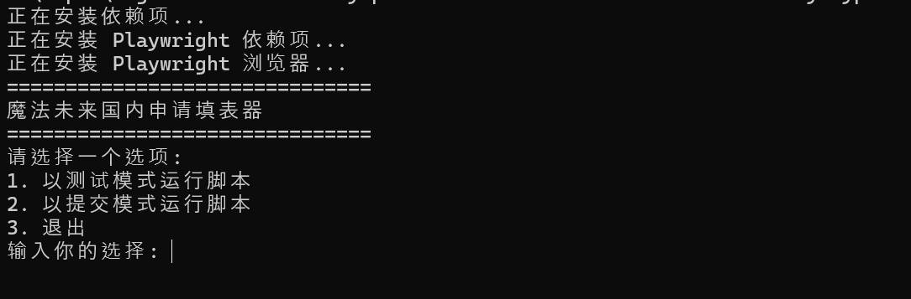

# 魔法未来国内申请填表器使用说明

## 截图



## 运行工具

1. 确保您已经安装了 Node.js。如果未安装，`run.bat` 会自动下载并安装 Node.js。
2. 双击或运行 `run.bat` 文件。该脚本将执行以下操作：

- 检查并安装 Node.js（如果尚未安装）。
- 安装项目依赖项。
- 安装 Playwright 及其浏览器依赖项。

3. 运行脚本后，您将看到以下菜单选项：

- 1. 以测试模式运行脚本
- 2. 以提交模式运行脚本
- 3. 退出

4. 选择相应的选项并按回车键：

- 选择 `1` 将以测试模式运行脚本（不会提交申请）。
- 选择 `2` 将以提交模式运行脚本（会提交申请）。
- 选择 `3` 将退出脚本。

5. 确认继续操作时，请确保您已在 `applications.csv` 文件中修改并添加所有申请条目。

**注意！在选择提交模式后，系统将提示您输入最后确认码。请手动输入确认码以继续操作。注意：确认码需要您自行识别，本脚本不提供自动识别功能。提交模式最后要记得观察打开的浏览器，等待最后一步要输入确认码。**

## 编辑 `applications.csv`

`applications.csv` 文件包含所有申请条目。请按照以下格式编辑文件：

```plaintext
applicationPassword,firstName,firstNameKana,lastName,lastNameKana,email,phone,gender,birthDate,postalCode,showNo,peerName,peerPhone,piaEmail,piaPassword,paymentType,creditCardNo,creditCardMonth,creditCardYear,creditCardCVV
```

### 列说明

- `applicationPassword`: 申请密码 （6位数字）
- `firstName`: 名字 （全角英文）
- `firstNameKana`: 名字的假名
- `lastName`: 姓氏 （全角英文）
- `lastNameKana`: 姓氏的假名
- `email`: 电子邮件地址
- `phone`: 电话号码
- `gender`: 性别
- `birthDate`: 出生日期 (格式: YYYY-MM-DD)
- `postalCode`: 邮政编码 （格式：NNN-NNNN）需要是有效的日本邮政编码
- `showNo`: 演出编号 （1-17， 按照官网申请表顺序）
- `peerName`: 同行者名字 （片假名日文）
- `peerPhone`: 同行者电话
- `piaEmail`: Pia 账户电子邮件
- `piaPassword`: Pia 账户密码
- `paymentType`: 支付类型 (例如: creditCard，711)
- `creditCardNo`: 信用卡号码 （信用卡支付类型必填）
- `creditCardMonth`: 信用卡有效期月份 (格式: MM)（信用卡支付类型必填）
- `creditCardYear`: 信用卡有效期年份 (格式: YYYY)（信用卡支付类型必填）
- `creditCardCVV`: 信用卡 CVV 码（信用卡支付类型必填）

### 示例条目

```plaintext
393939,太郎,タロウ,山田,ヤマダ,example@example.com,09012345678,男,1990-01-01,1234567,1,花子,09087654321,pia@example.com,piaPassword,creditCard,1234567812345678,12,2025,123
```

## 输出申请信息

运行脚本后，生成的申请信息将保存在 `results-YYYY-MM-DDTHH-MM-SS.sssZ.csv` 文件中。文件名中的时间戳表示生成文件的时间。

### 输出文件格式

输出文件包含以下列：

```plaintext
firstName,lastName,email,applicationId,applicationPassword,slcd,summary
```

### 列说明

- `firstName`: 名字
- `lastName`: 姓氏
- `email`: 电子邮件地址
- `applicationId`: 申请编号
- `applicationPassword`: 申请密码
- `slcd`: 申请状态代码
- `summary`: 申请摘要

### 示例输出

```plaintext
太郎,山田,example@example.com,123456,393939,0,申请成功
```

请根据需要查看和保存输出文件中的申请信息。

## 合作条例

欢迎大家对本项目进行修改和提出 issue 及建议，但请注意作者不保证能解答所有问题。对于大多数常见问题，请大家先自行查阅文档或在社区中寻找答案。

## 免责声明

本工具仅供个人使用，请勿用于任何商业用途。使用本工具所产生的任何后果，开发者不承担任何责任。

## 开源许可

本项目基于 MIT 许可证开源。详细信息请参阅 [LICENSE](./LICENSE) 文件。

## 反对黄牛行为

我们强烈反对任何形式的黄牛行为。请勿使用本工具进行任何违反法律或道德的活动。
